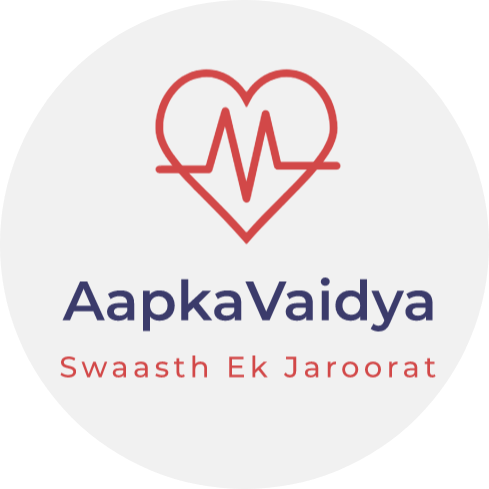

# Aap Ka Vaidya - Swaasth ek Jaroorat

 

## ✍&nbsp;  About the Project

=> A flutter android application for Easy interaction between patient's and doctors. During pandemic many of the patients are looking to get a regular health check-ups but due lockdowns this seems impossible.

=> So the application is build for this problem, it consists of chatbox(static) , login/signup page, cool animations, covid tracker using webview, also addon to this there is a relax zone which comprises of Games and Music,

=> The app uses YouTube API to call the videoplayer to get indulge in streaming youtube videos there, nearby locations is also set using Google Map API.

 

## 📫&nbsp; Getting Started

### To run the application on your local machine:
  
=> Open your Git Bash command window and in the root directory type the following commands:

    1) git init -initializes the git repository from the GitHub. 
    2) git clone -Clone the repository to your local machine
=> Open your Android IDE:

    1) Open the file at the root directory
    2) Code your modifications in the project

 

### 🤖&nbsp; Some useful links to learn flutter:

- [Lab: Write your first Flutter app](https://flutter.dev/docs/get-started/codelab)
- [Cookbook: Useful Flutter samples](https://flutter.dev/docs/cookbook)

For help getting started with Flutter, view our
[online documentation](https://flutter.dev/docs), which offers tutorials,
samples, guidance on mobile development, and a full API reference.

 

## 📷&nbsp; Screenshots

[Google Drive](https://drive.google.com/drive/folders/1-sGdGiSpPj9aVyV63lkOmHf7PQ-4zroP?usp=sharing)

 

## 📽&nbsp; Link for the Video Demo

[YouTube](https://www.youtube.com/watch?v=xHoPp9_jX0Y&t=83s)

 

### ❤️&nbsp; Project Contributor

                                                                                         |
| :------------------------------------------------------------------------------------------------------------------------------------------------------------------------------------------------------------------------------------------------------------------------------------------------------------------------------------------: |
|                                                                                                                                        **[Harshit Singh](https://www.linkedin.com/in/harshit-singh-lko//)**                                                                                                                                        |
| |

---
                                                                                         |
| :------------------------------------------------------------------------------------------------------------------------------------------------------------------------------------------------------------------------------------------------------------------------------------------------------------------------------------------: |
|                                                                                                                                        **[Dhruv Singla](https://www.linkedin.com/in/dhruv-singla-116598135/)**                                                                                                                                        |
| | 

 

<a href="https://github.com/Nisha2701"><a>                                                                                         |
| :------------------------------------------------------------------------------------------------------------------------------------------------------------------------------------------------------------------------------------------------------------------------------------------------------------------------------------------: |
|                                                                                                                                        **[Nisha](https://www.linkedin.com/in/nisha-88b887191/)**                                                                                                                                        |
| |
